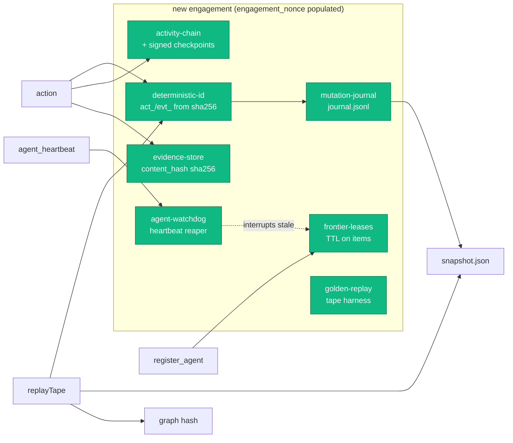

# Architecture

Overwatch inverts the typical "LLM-as-orchestrator" pattern. Instead of stuffing engagement state into a prompt, the orchestrator is a **persistent MCP server** that the LLM calls into.

> For the user-facing runtime shape — one engine, two surfaces (terminal + dashboard), and how they tie together — start with the [Runtime Model](runtime-model.md). This page covers the internal component decomposition and the deterministic-vs-LLM split.

## System Diagram


## Data Flow Example

Here's a concrete walkthrough of how data flows through the system during a typical engagement step:


Every step is traceable: `action_id` links `validate_action` → `log_action_event` → `parse_output` → `report_finding`. The activity log records the causal chain with tiered truncation that preserves milestone and causal-linkage events (validations, parse results, warnings, session states, errors) while trimming ephemeral events to stay within budget. Full evidence payloads are stored durably in the evidence store and referenced by `evidence_id`.

## Design Decisions

### Graph, Not Database

Engagements are directed property graphs — hosts, services, credentials, and the relationships between them. The graph structure means "credential X is valid on service Y which runs on host Z" is a traversable path, not three rows in a table.

The graph is powered by [graphology](https://graphology.github.io/), a robust JavaScript graph library, with shortest-path analysis via `graphology-shortest-path` and community detection via `graphology-communities-louvain`.

**Community detection** runs Louvain modularity optimization on an undirected projection of the graph. Results are cached outside the durable graph and projected as `community_id` on public graph/frontier views, so derived layout data does not become replay authority. Communities feed two consumers:

- **Frontier** — each `FrontierItem` carries `community_id` and `community_unexplored_count`, letting the LLM reason about cluster coverage
- **Dashboard** — convex hull overlays color-code communities in the graph visualization

### MCP Server, Not a Prompt

The orchestrator survives context compaction by design — it's not in the context window. After compaction, `get_state()` reconstructs an operational briefing from durable graph and coordination state. Live handles, terminal buffers, unsaved UI drafts, and other explicitly ephemeral runtime state are not reconstructed.

Two transports are supported:

- **stdio** — the default, using the [Model Context Protocol](https://modelcontextprotocol.io/) over standard I/O. This is how Claude Code connects.
- **HTTP/SSE** — streamable HTTP transport for remote deployment, web-based consumers, and multiple simultaneous clients. Enable with `OVERWATCH_TRANSPORT=http` or the `--http` CLI flag.

The core app bootstrap (`src/app.ts`) is transport-neutral — both transports share the same `GraphEngine`, skills, and services. Each HTTP session gets its own `McpServer` instance (SDK limitation: one `connect()` per server) but all sessions share the underlying graph.

### Hybrid Scoring

The deterministic layer handles hard constraints:

- **Scope enforcement** — targets outside CIDRs/domains are rejected
- **Deduplication** — already-tested edges don't re-enter the frontier
- **OPSEC vetoes** — techniques exceeding the noise ceiling are filtered
- **Dead host pruning** — unreachable hosts are deprioritized

The LLM handles nuanced reasoning:

- **Attack chain spotting** — connecting discoveries across multiple hops
- **Sequencing** — determining what should happen before what
- **Risk assessment** — weighing reward against defensive posture
- **Creative path discovery** — finding non-obvious routes through the graph

### Inference Rules

When findings are reported, deterministic rules fire automatically to generate hypothesis edges. Sixty-four built-in rules span Active Directory, ADCS, Linux privilege escalation, web application, MSSQL, and cloud domains:

| Domain | Rules | Examples |
|--------|-------|----------|
| **AD & Service** | 21 | Kerberos → Domain, SMB Relay, Credential Fanout, ADCS ESC1–ESC8+, Delegation, Roasting, LAPS/gMSA, RBCD, DACL escalation, Shadow Credentials, GPO abuse, DCSync |
| **ADCS** | 14 | ESC1–ESC8, ESC9/10/11, ESC13, EDITF_ATTRIBUTESUBJECTALTNAME2 |
| **Linux Privesc** | 7 | SUID root, SSH key reuse, Docker escape, NFS no_root_squash, sudo NOPASSWD, dangerous capabilities, writable cron/systemd |
| **Web** | 8 | Webapp login spray, web login form, token→webapp auth, auth bypass escalation, default CMS creds, IMDSv1 SSRF |
| **MSSQL** | 2 | Linked server → REACHABLE, xp_cmdshell → code execution |
| **Cloud** | 3 | Overprivileged policy, public bucket, cross-account role |

Many rules use **edge-triggered inference** — they require a matching inbound edge (`requires_edge` field) in addition to the node property match. When a new or updated edge arrives, inference also re-evaluates its endpoints. Edge-triggered rules span AD (LAPS, gMSA, RBCD, DACL escalation, Shadow Credentials, GPO abuse, DCSync), cloud (cross-account role), and MSSQL (linked server + domain).

See [Graph Model — Inference Rules](graph-model.md#inference-rules) for the full rule reference with triggers and productions. Custom rules can be added at runtime via [`suggest_inference_rule`](tools/suggest-inference-rule.md). See [Concepts](concepts.md#inference-rules) for how the rule lifecycle works.

### Full Graph Access

The LLM isn't restricted to scored frontier items. [`query_graph`](tools/query-graph.md) gives unrestricted access to the entire graph for creative path discovery. [`find_paths`](tools/find-paths.md) provides shortest-path analysis between any nodes or toward objectives.

## Component Overview


### Core

| Component | File | Purpose |
|-----------|------|---------|
| **Entrypoint** | `src/index.ts` | Config loading, server init, tool registration |
| **Config** | `src/config.ts` | Engagement config parsing and validation |
| **Types** | `src/types.ts` | Shared types + Zod schemas |

### Services

| Component | File | Purpose |
|-----------|------|---------|
| **Graph Engine** | `src/services/graph-engine.ts` | Core graph operations, state coordination |
| **Engine Context** | `src/services/engine-context.ts` | Mutable state container, update callbacks |
| **Frontier** | `src/services/frontier.ts` | Frontier item generation and filtering |
| **Inference Engine** | `src/services/inference-engine.ts` | Rule matching and hypothesis edge generation |
| **Path Analyzer** | `src/services/path-analyzer.ts` | Shortest-path and objective reachability |
| **Identity Resolution** | `src/services/identity-resolution.ts` | Canonical ID generation, marker matching |
| **Identity Reconciliation** | `src/services/identity-reconciliation.ts` | Alias node merging, edge retargeting |
| **Graph Schema** | `src/services/graph-schema.ts` | Node/edge type validation |
| **Graph Health** | `src/services/graph-health.ts` | Integrity checks and diagnostics |
| **Finding Validation** | `src/services/finding-validation.ts` | Input validation and normalization |
| **State Persistence** | `src/services/state-persistence.ts` | Atomic write-rename with snapshot rotation; always replays an existing [Mutation Journal](#mutation-journal-write-ahead-log) and enables one for managed active engagements |
| **Activity Chain** | `src/services/activity-chain.ts` | Tamper-evident SHA-256 chain over agent/system events; signed checkpoints for O(events_since_checkpoint) verification (default-on for new engagements) |
| **Mutation Journal** | `src/services/mutation-journal.ts` | Write-ahead log of graph mutations; replay on load + compaction after snapshot. Enabled for managed active engagements and deterministic-ID contexts; an existing WAL is always recovered |
| **Deterministic ID** | `src/services/deterministic-id.ts` | sha256-derived action and event IDs for engagements with `engagement_nonce`; `uuidv4` fallback for legacy |
| **Frontier Leases** | `src/services/frontier-leases.ts` | TTL leases on frontier items so two agents can't race on the same target |
| **Agent Watchdog** | `src/services/agent-watchdog.ts` | Periodic reaper for stale heartbeats and expired frontier leases |
| **Decision Log** | `src/services/decision-log.ts` | Derived view: per-action timeline (frontier_emitted → ... → completed) over the activity log |
| **Introspection** | `src/services/introspection.ts` | "Why did the agent do X?" — frontier item, log_thought chain, alternatives, validation, outcome for an action_id |
| **Timeline** | `src/services/timeline.ts` | Per-node and per-edge "what was true at time T" derivation over graph + activity log |
| **Golden Replay** | `src/services/golden-replay.ts` | Tape-driven byte-identical replay harness; canonical graph hash for regression detection |
| **Sub-agent IPC** | `src/services/subagent-ipc.ts`, `src/services/subagent-process-runner.ts` | Typed JSON-over-stdio contract + parent-side runner for the optional `subagent_isolation: 'process'` mode (default `'in_process'`) |
| **Skill Index** | `src/services/skill-index.ts` | TF-IDF search over skill library |
| **Output Parsers** | `src/services/parsers/` | 75 parsers / 130 `parse_output` keys: nmap, nxc, certipy, secretsdump, kerbrute, hashcat, responder, ldapsearch, enum4linux, rubeus, web dir enum, linpeas/linenum, nuclei, nikto, testssl/sslscan, pacu, prowler, burp, zap, sqlmap, wpscan, httpx, dnsx, amass, subfinder, crtsh, whois, theHarvester, trufflehog, secretfinder, linkfinder, openapi/swagger/graphql, security-headers, gowitness/aquatone, katana/hakrawler/gau, test-webapp-credential, … |
| **Parser Utils** | `src/services/parser-utils.ts` | Shared parsing helpers and canonical ID generation |
| **Credential Utils** | `src/services/credential-utils.ts` | Credential normalization, lifecycle, and domain inference |
| **Provenance Utils** | `src/services/provenance-utils.ts` | Source attribution tracking |
| **BloodHound Ingest** | `src/services/bloodhound-ingest.ts` | SharpHound v4/v5 (CE) JSON → graph |
| **AzureHound Ingest** | `src/services/azurehound-ingest.ts` | AzureHound / ROADtools JSON → graph |
| **Community Detection** | `src/services/community-detection.ts` | Louvain modularity for graph clustering |
| **Dashboard Server** | `src/services/dashboard-server.ts` | HTTP + WebSocket for live visualization |
| **Delta Accumulator** | `src/services/delta-accumulator.ts` | Debounced graph change tracking for broadcasts |
| **Cold Store** | `src/services/cold-store.ts` | Promotion-only compaction for large network sweeps |
| **Agent Manager** | `src/services/agent-manager.ts` | Sub-agent task lifecycle |
| **Task Execution Service** | `src/services/task-execution-service.ts` | Routes each `AgentTask` to its backend (scripted / headless_mcp / manual); owns the headless concurrency cap, per-task wall-clock timeout, watchdog, and process registry |
| **Headless MCP Runner** | `src/services/headless-mcp-runner.ts` | Spawns a `claude -p` reasoning sub-agent connected back to this daemon's `/mcp`; role→tool-allowlist (`default`/`research`/`planner`) + per-task mcp-config |
| **Command Interpreter** | `src/services/command-interpreter.ts` | NL operator command → `OperatorOp[]` deterministic grammar + `executeOps` (the single validated dashboard mutation path). See [Operator Cockpit](operator-cockpit.md) |
| **Proposed Plan Store** | `src/services/proposed-plan-store.ts` | Engine-owned durable plans the `planner` role proposes via `propose_plan`, including ownership, expiry, confirmation, acknowledgement, and execution outcome |
| **Agent Query Store** | `src/services/agent-query-store.ts` | Engine-owned durable agent→operator questions (`ask_operator`); answers are redelivered on heartbeat as `pending_answer` until explicitly acknowledged |
| **Retrospective** | `src/services/retrospective.ts` | Post-engagement analysis and RLVR traces |
| **CIDR** | `src/services/cidr.ts` | CIDR parsing, expansion, and scope matching |
| **Tool Check** | `src/services/tool-check.ts` | Offensive tool availability detection |
| **Process Tracker** | `src/services/process-tracker.ts` | PID tracking for long-running scans |
| **Lab Preflight** | `src/services/lab-preflight.ts` | Lab readiness validation |
| **Session Manager** | `src/services/session-manager.ts` | Persistent interactive sessions, RingBuffer, ownership enforcement. Session close (operator, process exit, or shutdown) downgrades `HAS_SESSION` edges to `session_live=false`. |
| **Session Adapters** | `src/services/session-adapters.ts` | LocalPty (node-pty), SSH, and Socket transport adapters |
| **Prompt Generator** | `src/services/prompt-generator.ts` | Dynamic system prompt generation for primary and sub-agent roles |
| **Report Generator** | `src/services/report-generator.ts` | Per-finding sections, evidence chains, attack narrative, auto-remediation |
| **Report HTML** | `src/services/report-html.ts` | Self-contained HTML report renderer with themes and print CSS |
| **Campaign Planner** | `src/services/campaign-planner.ts` | Campaign assembly, progress tracking, abort conditions |
| **Chain Scorer** | `src/services/chain-scorer.ts` | Multi-hop credential chain scoring |
| **OPSEC Tracker** | `src/services/opsec-tracker.ts` | Dynamic noise budget tracking per host/domain/global |
| **Pending Action Queue** | `src/services/pending-action-queue.ts` | Operator approval gates for actions |
| **Evidence Store** | `src/services/evidence-store.ts` | Durable evidence blob storage with action/finding linkage. Records carry a `content_hash` (sha256) so identical content from two runs deduplicates and lookups accept either evidence_id (UUID) or content_hash. Streaming sinks finalize the hash on close. |
| **Finding Ingestion** | `src/services/finding-ingestion.ts` | Finding validation pipeline and graph mutation |
| **Imperative Inference** | `src/services/imperative-inference.ts` | Imperative (code-driven) inference rule execution |
| **Scope Manager** | `src/services/scope-manager.ts` | Engagement scope governance and validation |
| **Graph Query** | `src/services/graph-query.ts` | Structured graph queries with filtering |
| **Objective Manager** | `src/services/objective-manager.ts` | Objective CRUD, achievement evaluation, phase tracking |
| **Session Tracker** | `src/services/session-tracker.ts` | HAS_SESSION edge lifecycle, frontier marking, startup reconciliation |
| **Config Manager** | `src/services/config-manager.ts` | Config seeding, update validation, scope/opsec merging |
| **Tool Telemetry** | `src/services/tool-telemetry.ts` | Runtime tool call counting, timing, sequence analysis |
| **Engine Context** | `src/services/engine-context.ts` | Service container and dependency wiring |

### Tools

| Module | File | Tools |
|--------|------|-------|
| **State** | `src/tools/state.ts` | `get_state`, `run_lab_preflight`, `run_graph_health`, `recompute_objectives`, `get_history`, `export_graph` |
| **Recovery** | `src/tools/recovery.ts` | `get_recovery_status`, `resolve_config_divergence` |
| **Scoring** | `src/tools/scoring.ts` | `next_task`, `validate_action` |
| **Findings** | `src/tools/findings.ts` | `report_finding`, `get_evidence` |
| **Exploration** | `src/tools/exploration.ts` | `query_graph`, `find_paths` |
| **Agents** | `src/tools/agents.ts` | `register_agent`, `dispatch_agents`, `get_agent_context`, `update_agent`, `dispatch_subnet_agents`, `dispatch_campaign_agents`, `manage_campaign`, `agent_heartbeat` |
| **Decision Log** | `src/tools/decision-log.ts` | `get_decision_log` |
| **Introspection** | `src/tools/introspection.ts` | `explain_action` |
| **Timeline** | `src/tools/timeline.ts` | `get_timeline` |
| **Skills** | `src/tools/skills.ts` | `get_skill` |
| **Logging** | `src/tools/logging.ts` | `log_action_event` |
| **Parse Output** | `src/tools/parse-output.ts` | `parse_output` |
| **Inference** | `src/tools/inference.ts` | `suggest_inference_rule` |
| **BloodHound** | `src/tools/bloodhound.ts` | `ingest_bloodhound` |
| **Tool Check** | `src/tools/toolcheck.ts` | `check_tools` |
| **Processes** | `src/tools/processes.ts` | `track_process`, `check_processes` |
| **Remediation** | `src/tools/remediation.ts` | `correct_graph` |
| **Retrospective** | `src/tools/retrospective.ts` | `run_retrospective` |
| **Sessions** | `src/tools/sessions.ts` | `open_session`, `write_session`, `read_session`, `send_to_session`, `list_sessions`, `update_session`, `resize_session`, `signal_session`, `close_session` |
| **Scope** | `src/tools/scope.ts` | `update_scope` |
| **Instructions** | `src/tools/instructions.ts` | `get_system_prompt` |
| **Reporting** | `src/tools/reporting.ts` | `generate_report` |
| **AzureHound** | `src/tools/azurehound.ts` | `ingest_azurehound` |

### Dashboard

The dashboard is a React SPA built with Vite, served from `src/dashboard-next/`
(build output: `dist/dashboard-next/`). It exposes panels for engagements,
campaigns, agents, sessions (xterm-based terminal multiplexer), pending
actions, frontier, activity, evidence, settings, telemetry, and a sigma.js
graph explorer with attack-path overlay, focus presets, community hulls,
edit mode, and minimap.

| Area | Source |
|------|--------|
| Entry shell | `src/dashboard-next/src/main.tsx`, `App.tsx` |
| Layout | `src/dashboard-next/src/components/layout/` (Toolbar, Sidebar, OperatorLayout, TapeToggle) |
| Panels | `src/dashboard-next/src/components/panels/` |
| Graph explorer | `src/dashboard-next/src/components/graph/` (sigma.js + hooks) |
| State | `src/dashboard-next/src/stores/` (Zustand) |
| API client | `src/dashboard-next/src/lib/api.ts` |
| WebSocket | `src/dashboard-next/src/providers/ws-provider.tsx` |

## State Persistence

Graph state is persisted to `state-<engagement-id>.json` after every finding using atomic write-rename:

```
1. Serialize graph + metadata to JSON
2. Write to temporary file (state-<id>.json.tmp)
3. Atomic rename over the real file
4. Previous version moved to snapshot rotation
```

Features:

- **Snapshot rotation** — keeps recent snapshots for rollback
- **Crash recovery** — incomplete writes never corrupt state (temp file is discarded)
- **Resume anywhere** — restart Claude Code, restart the server, come back days later
- **Post-engagement analysis** — persisted state feeds retrospective analysis

### Mutation Journal (Write-Ahead Log)

Managed active engagements layer a write-ahead log on top of the snapshot. Standalone deterministic-ID contexts also enable it through `engagement_nonce`, and any existing WAL is recovered regardless of the current config:

- Every graph-affecting mutation (`add_node`, `add_edge`, `merge_node_attrs`, `drop_edge`) appends a `MutationEntry { seq, ts, type, payload }` to `<state-file>.journal.jsonl` and `fsync`s **before** the in-memory mutation is applied.
- On load, the engine reads the snapshot, then replays journal entries with `seq > journalSnapshotSeq`. A crash between journal append and the next snapshot rotation is recoverable.
- Snapshot rotation truncates the journal up to the snapshot's seq. Crash mid-write leaves a partial line; the reader stops at it without poisoning subsequent replays.

Unmanaged legacy contexts with neither a nonce nor an existing WAL retain the debounced-snapshot-only path.

## Foundations: Trust, Audit, Replay

Engagements created after the foundations work shipped get a coordinated set of guarantees. Deterministic identity remains gated on `engagement_nonce`; WAL durability is additionally enabled for every managed active engagement and always honors existing journal data.

| Guarantee | What it gives you | Where it lives |
|---|---|---|
| **Hash-chained activity log** | Tamper-evident SHA-256 chain over agent/system events. Default-on for new engagements. Signed checkpoints emitted every 500 events / 30 minutes so verifiers don't have to re-walk genesis. | `src/services/activity-chain.ts` |
| **Content-addressed evidence** | Every evidence row carries `content_hash = sha256(content)`. Two runs with identical output deduplicate; tampering changes the address. Lookups accept either UUID or hash. | `src/services/evidence-store.ts` |
| **Deterministic action / event IDs** | `act_<16hex>` / `evt_<16hex>` derived from `sha256(nonce \| agent_id \| timestamp \| command_signature \| sequence)`. Same inputs → same IDs. | `src/services/deterministic-id.ts` |
| **Caller-provided clocks** | `engine.withClock(now, fn)` pins time across a sequence of mutations so timestamps don't leak wall-clock noise into golden-master fixtures. | `src/services/engine-context.ts` (`withClock`, `nowIso`) |
| **Write-ahead log** | Crash-safe state recovery; mutation lost only when the journal append itself fails. | `src/services/mutation-journal.ts` |
| **Golden-master replay** | Replaying a tape against a fresh engine produces a byte-identical state hash. Real-behavior change requires explicit re-recording. | `src/services/golden-replay.ts`, fixtures in `src/__tests__/golden-master/` |
| **Frontier leases + heartbeat** | Two agents can't claim the same frontier item; silent sub-agents get reaped. | `src/services/frontier-leases.ts`, `src/services/agent-watchdog.ts` |

For the threat model context — what these mitigate, what's still residual — see [Threat Model](threat-model.md).



The whole substrate snaps together when the engagement carries a nonce: deterministic IDs identify replayed operations, the journal feeds recovery, the activity chain records causality, and the chain references content-addressed evidence. Managed active engagements receive the journal/recovery guarantee even without deterministic IDs. Each layer is independent at the implementation level but composes into a single audit story.

## Session + Transport Architecture


Two MCP transports (stdio default, HTTP/SSE for remote). Persistent interactive sessions with 3 adapters (LocalPty, SSH, Socket), 128KB ring buffers, cursor-based I/O, and TTY quality tracking.

## Broadcast Pipeline

When the graph changes, updates flow to the dashboard in real time. The dashboard also polls `/api/state` every 5 seconds as a fallback when WebSocket is disconnected.
