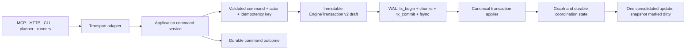

# Architecture

Overwatch keeps engagement truth outside any one model context. A long-lived
engine owns the graph, coordination records, evidence references, and recovery
state; terminal, dashboard, CLI, planner, and automated runners are adapters to
that engine.

> For the operator-facing shape—one daemon shared by terminal Claude, the CLI,
> dashboard, and dashboard-deployed agents—start with the [Runtime
> Model](runtime-model.md). This page describes the internal command and
> durability boundaries.

## System diagram

## Command and durability path

Mutating transports do not own business state. They validate their wire format
and invoke a transport-neutral application command:

The application-command boundary records a command ID, transport, actor task,
validated input hash, optional action/frontier/plan references, and an
actor-scoped idempotency key. A retry with the same identity and input returns
the stored outcome; reuse with different input is rejected as a conflict. This
keeps dashboard, MCP, CLI, planner, scripted-runner, and headless-runner retries
from performing the same mutation twice.

Domain command services cover dispatch, campaigns, agent lifecycle, approvals,
configuration and scope, graph correction, parsing/ingestion, processes,
sessions, playbooks, recovery, and operator plans. Read-only adapters may call
query/projector services directly. Adapters parse and format; durable mutation
authority remains in the command service and engine transaction applier.

An `EngineTransaction` is the logical durability unit. Its normal path is:

1. Validate the command and build deterministic derived changes.
2. Freeze the operation draft.
3. append and `fsync` a complete journal-v2 transaction;
4. apply it through the canonical applier used by recovery;
5. advance only the contiguous successfully applied checkpoint;
6. publish one consolidated update; and
7. mark the snapshot dirty.

If the durable commit succeeds but in-memory application fails, the journal
blocks further appends and the service enters recovery/read-only handling. It
does not continue from partially updated memory.

## Why a graph

Engagements are directed property graphs: hosts, services, credentials,
identities, findings, and the relationships between them. “Credential X is
valid on service Y running on host Z” is therefore a traversable path rather
than three unrelated rows.

The hot graph uses [graphology](https://graphology.github.io/), with
`graphology-shortest-path` for path analysis and
`graphology-communities-louvain` for community detection. Large, low-information
host inventories can remain in the cold store. Promotion into the hot graph is
a durable transaction, while derived community IDs and UI layouts are
rebuildable projections rather than replay authority.

The deterministic layer enforces hard constraints such as scope, duplicate
suppression, OPSEC vetoes, and dead-session handling. The reasoning model still
owns attack-chain judgment, sequencing, risk/reward, and creative path
discovery. [`query_graph`](tools/query-graph.md) and
[`find_paths`](tools/find-paths.md) provide unrestricted graph reads when the
frontier does not expose the pattern the operator needs.

## State taxonomy

“Persisted” does not mean every live object can resume. Overwatch makes the
boundary explicit:

| Class | Examples | Restart behavior |
|---|---|---|
| **Durable truth** | graph and cold store, active config revision/hash, objectives, rules, activity chain, deterministic counters, frontier linkage, evidence/report/tape/bundle references | Restored from a valid base plus committed WAL transactions |
| **Durable coordination** | agents, campaigns, approvals, directives, leases, plans, questions/answers, application-command outcomes, playbook runs/steps/attempts | Restored with original identities, ownership, timestamps, and terminal state |
| **Resumable descriptors** | runtime-run ownership records and secret-free session/listener descriptors | Reconciled against the operating system or exposed as `interrupted`, `unknown`, or `resume_available`; never presented as falsely live |
| **External artifacts** | evidence blobs, generated reports, tapes, bundles, cookie jars | Stored outside the state JSON and referenced by path/hash |
| **Ephemeral runtime** | PTYs, sockets, process objects, WebSocket clients, database connections, terminal buffers, telemetry caches, unsaved browser drafts | Not reconstructed |

[`get_state`](tools/get-state.md) builds an operational briefing from the
restored state. It is the right context-recovery call for an operator or model,
but it is not a lossless export of the state file, complete activity history,
evidence bytes, or ephemeral runtime. Use `get_history`, `get_evidence`,
`export_graph`, or `bundle_engagement` for those purposes.

## Persistence and recovery

### Versioned state

Current writers emit `PersistedStateV1` with `state_version: 1` and
`journal_version: 2`. A missing state version is legacy V0. Migration first
selects and fully replays the legacy recovery chain, creates and verifies a
checksummed backup, then publishes V1. Unsupported newer formats remain intact
and start read-only; they are never silently reseeded or downgraded.

See [Data Storage](reference/data-storage.md) for file locations, migration
backups, and portability.

### Transaction journal (WAL)

Every managed engagement uses the WAL, including engagements without an
`engagement_nonce`. Journal V2 represents one logical transaction as a
checksum-protected `tx_begin`, bounded operation chunks, and `tx_commit`.
Recovery exposes only a complete, checksum-valid committed transaction to the
applier. Primitive journal V1 records remain readable for legacy migration.

Startup selects the newest valid primary or retained snapshot base, then
replays every newer committed transaction in order. It stops at the first
unknown, malformed, skipped, or failed record and retains the unapplied tail.
Corrupt bytes and the following tail are preserved for diagnosis, including a
content-addressed quarantine copy where applicable. Only a contiguously applied
prefix already represented by a durable base is eligible for compaction.

A non-empty WAL without a valid base, an unsupported format, ambiguous
checkpoint, incomplete replay, config divergence, or unresolved mandatory
startup reconciliation puts the service in **degraded read-only mode**. Reads,
recovery status, and explicit reconciliation remain available; new durable or
target-facing mutations are rejected. The service does not create an empty
engagement over uncertain durable data.

Snapshots are atomic write-and-rename checkpoints. Up to five are retained.
Snapshot eligibility is write-triggered after the configured interval; it is
not a periodic timer that claims progress independently of durable mutations.

### Configuration convergence

`EngagementConfigService` gives an active configuration one revision and
SHA-256 semantic hash across the file, live engine, and durable state. A known
interrupted write is completed from its durable intent. Unexplained semantic
divergence remains read-only until the operator explicitly chooses file or
state authority with the observed hashes.

## Process and session truth

Detached target processes use durable runtime-run records containing run,
action, task, command fingerprint, PID/group/start identity, lifecycle,
evidence state, and timestamps. The managed supervisor reports its identity and
waits for durable acknowledgement before launching the target. On startup,
Overwatch verifies process identity before signaling a group, finalizes
interrupted work once, and reports reused or unverifiable PIDs as unresolved
instead of killing them.

Sessions persist listener/session identity, connection generation, adapter,
owner task, target references, validation defaults, capabilities, resume
policy, and timestamps—not secrets, buffers, or live handles. A disconnected
generation is non-live. After restart, PTY, SSH, and socket-connect descriptors
become interrupted; a rearm-listener descriptor becomes `resume_available` and
requires explicit `resume_session`. A resumed listener accepts a fresh
connection generation and creates a fresh `HAS_SESSION` relationship.

## Component map

### Core and durability

| Component | File | Responsibility |
|---|---|---|
| App bootstrap | `src/app.ts` | Transport-neutral engine construction and MCP tool registration |
| Graph engine | `src/services/graph-engine.ts` | Domain state, graph operations, recovery integration |
| Engine context | `src/services/engine-context.ts` | Transaction drafting, WAL-before-apply boundary, consolidated updates |
| Application commands | `src/services/application-command-service.ts` and `*-command-service.ts` | Validation, actor-scoped idempotency, durable outcomes, domain orchestration |
| Engine transaction | `src/services/engine-transaction.ts` | Versioned logical transaction and applier contract |
| Mutation journal | `src/services/mutation-journal.ts` | V2 framing, checksum validation, replay, contiguous checkpoints, compaction |
| State persistence | `src/services/state-persistence.ts` | Base selection, restore/replay, atomic snapshots, recovery status |
| Persisted state | `src/services/persisted-state.ts` | V1 state and durable descriptor schemas |
| State migration | `src/services/state-migration.ts` | V0 inspection, verified backup, V1 migration |
| Active configuration | `src/services/engagement-config-service.ts` | Revisioned file/runtime/state convergence and reconciliation |

### Domain and projections

| Component | File | Responsibility |
|---|---|---|
| Frontier/inference/path analysis | `src/services/frontier.ts`, `inference-engine.ts`, `path-analyzer.ts` | Candidate generation, deterministic hypotheses, reachability |
| Parse and ingest | `src/services/parse-ingest.ts`, `parse-command-service.ts`, `parsers/` | Shared parsing outcomes and transactional graph ingestion |
| Agents and execution | `src/services/agent-manager.ts`, `task-execution-service.ts`, `headless-mcp-runner.ts` | Agent identity/lifecycle and isolated execution backends |
| Playbooks | `src/services/playbook-run-service.ts`, `playbook-command-service.ts` | Durable definitions, runs, dependencies, attempts, and ownership |
| Runtime ownership | `src/services/process-tracker.ts`, `process-command-service.ts` | Managed process supervision and startup reconciliation |
| Sessions | `src/services/session-manager.ts`, `session-command-service.ts`, `session-adapters.ts` | Listener intent, connection generations, live adapters, idle reaping |
| Dashboard | `src/services/dashboard-server.ts`, `src/dashboard-next/` | HTTP/WS adapters and browser projections |
| Evidence and reports | `src/services/evidence-store.ts`, `report-generator.ts` | Content-addressed raw evidence and rendered artifacts |

## Transport model

The primary transports are MCP stdio, streamable MCP HTTP, dashboard/CLI HTTP,
and dashboard WebSockets. Each adapter reaches the same engine and command
services. HTTP MCP sessions use separate SDK `McpServer` objects because one
server object can connect only once, but those objects share the engine.

Headless `claude -p` agents connect back to the daemon's MCP endpoint with a
task-scoped tool allowlist and isolated Claude configuration. The operator's
terminal Claude and dashboard-deployed agents therefore share durable
engagement state and leases without sharing Claude session identity or project
hooks. See the [Deployment Architecture](deployment-architecture.md) for the
driver decision and the [Runtime Model](runtime-model.md) for startup and
operator workflow.

## Audit and evidence

`action_id` and `frontier_item_id` link validation, approval, execution,
parsing, findings, and evidence. The bounded activity log preserves causal and
milestone events; content-addressed evidence stores full payloads separately.
When `engagement_nonce` is present, action and event IDs are deterministic for
replay. WAL durability itself does not depend on the nonce.

See [Threat Model](threat-model.md) for residual trust boundaries and [Graph
Model](graph-model.md) for the node, edge, inference, and cold-store model.
