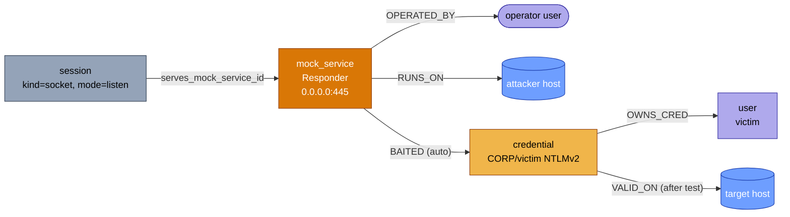

# Key Concepts

Overwatch uses several domain-specific terms throughout its tools and documentation. This page defines each one.

## Engagement Graph

The core data structure. A **directed property graph** where nodes represent discovered entities (hosts, services, credentials, users) and edges represent relationships between them (`RUNS`, `VALID_ON`, `ADMIN_TO`, etc.). Every tool reads from or writes to this graph.

The graph is powered by [graphology](https://graphology.github.io/) and persisted to disk after every change. See [Graph Model](graph-model.md) for the full schema.

## Frontier Item

A **candidate next action** generated from the graph. The deterministic layer produces frontier items by scanning the graph for:

| Type | Meaning | Example |
|------|---------|---------|
| `incomplete_node` | A node missing expected properties or relationships | Host with no service enumeration |
| `untested_edge` | An edge that exists but hasn't been validated | `POTENTIAL_AUTH` credential → service |
| `inferred_edge` | A hypothesis edge created by an inference rule | `RELAY_TARGET` from SMB signing disabled |
| `network_discovery` | CIDR scope with undiscovered hosts | Network sweep of 10.10.10.0/24 |
| `network_pivot` | Host reachable via pivot but without a session | Host in same subnet as session-holder |
| `credential_test` | Untested credential/target pair from the coverage matrix | Test `jdoe:NTLM` against DC01 (SMB) |

Frontier items include **graph metrics** (hops to objective, fan-out estimate, node degree) but are **not scored** — scoring is the LLM's job. The deterministic layer only filters out items that are out-of-scope, duplicated, or exceed the OPSEC noise ceiling.

Access frontier items via [`next_task`](tools/next-task.md).

## Inference Rules

Deterministic rules that fire automatically when matching nodes are ingested. They generate **hypothesis edges** — low-confidence relationships the LLM should evaluate.


**Lifecycle:**

```
1. Agent reports a finding (new node/edge enters the graph)
2. Engine checks all registered rules against the new node
3. Matching rules produce new edges (confidence 0.3–0.7)
4. New edges become frontier items (type: inferred_edge)
5. LLM sees them via next_task, decides whether to test
6. If tested successfully, confidence is raised to 1.0
```

**Example:** When a service node with `smb_signing: false` is ingested, the "SMB Signing → Relay" rule fires and creates `RELAY_TARGET` edges from all compromised hosts to that service.

Fifty-five built-in rules ship with Overwatch across five domains: AD & service (21), ADCS (14), Linux privilege escalation (7), web application (8), MSSQL (2), and cloud infrastructure (3). This includes **edge-triggered rules** that require both a node property match and a matching inbound edge (e.g., LAPS readable requires `laps: true` + inbound `GENERIC_ALL`). When a new edge arrives, the engine re-evaluates inference on its endpoints.

Custom rules can be added at runtime via [`suggest_inference_rule`](tools/suggest-inference-rule.md). See [Graph Model — Inference Rules](graph-model.md#inference-rules) for the full rule reference with triggers and productions.

## Confidence

A `0.0` to `1.0` value on every node and edge indicating how certain the information is:

| Range | Meaning | Example |
|-------|---------|---------|
| `0.0 – 0.3` | Hypothesis | Inferred `POTENTIAL_AUTH` edge from credential fanout |
| `0.3 – 0.7` | Likely | Service version from banner grab, unverified credential |
| `0.7 – 0.9` | Strong evidence | Successful authentication attempt |
| `1.0` | Confirmed | Verified admin access, dumped credentials |

Confidence affects frontier item prioritization — lower-confidence edges are more valuable to test because they have the most uncertainty to resolve.

## OPSEC Noise

A `0.0` to `1.0` rating on actions and edge types indicating how likely they are to trigger detection:

| Rating | Level | Examples |
|--------|-------|----------|
| `0.0 – 0.2` | Silent | DNS queries, passive enumeration |
| `0.2 – 0.4` | Quiet | Targeted port scans, LDAP queries |
| `0.4 – 0.6` | Moderate | SMB enumeration, Kerberoasting |
| `0.6 – 0.8` | Loud | Password spraying, brute force |
| `0.8 – 1.0` | Very loud | Mass scanning, exploit attempts |

The engagement's OPSEC profile sets a **`max_noise` ceiling**. Actions exceeding this ceiling are:

- Filtered from the frontier by the deterministic layer
- Rejected by [`validate_action`](tools/validate-action.md)

**Blacklisted techniques** (e.g., `zerologon`) are rejected regardless of noise level.

See [Configuration](configuration.md#opsec-profiles) for profile options.

## Compaction

When the LLM's context window overflows, Claude Code **compacts** — summarizing the conversation history to free up space. This would normally lose engagement state.


Overwatch survives compaction because the graph lives outside the context window. After compaction:

1. Claude Code starts a fresh context
2. The `AGENTS.md` instructions tell it to call `get_state()` first
3. `get_state()` reconstructs a complete briefing from the graph:
    - Scope and objectives
    - All discoveries and access
    - Current frontier items
    - Active agents
    - Recent activity
4. The LLM resumes exactly where it left off

This also works across server restarts, session handoffs, and multi-day engagements.

**Startup Reconciliation:** On restart, the engine automatically reconciles runtime-dependent state:
- **HAS_SESSION edges** are downgraded from `session_live=true` to `session_live=false` since no runtime sessions survive a restart.
- **Running agents** are marked as `interrupted` since the sub-agent processes no longer exist.
- **Tracked processes** are checked for PID liveness; dead PIDs are marked as completed.

## Node ID Conventions

Every node needs a unique, deterministic ID. Overwatch uses these conventions:

| Node Type | Pattern | Example |
|-----------|---------|---------|
| Host | `host-<ip>` | `host-10-10-10-5` |
| Service | `svc-<ip>-<port>` | `svc-10-10-10-5-445` |
| Domain | `domain-<name>` | `domain-target-local` |
| User | `user-<domain>-<username>` | `user-target-local-administrator` |
| Group | `group-<domain>-<name>` | `group-target-local-domain-admins` |
| Credential | `cred-<type>-<user>` | `cred-ntlm-administrator` |
| Share | `share-<host>-<name>` | `share-10-10-10-5-c$` |
| Certificate | `cert-<template>` | `cert-user-template` |
| Objective | `obj-<id>` | `obj-da` |

Consistent IDs enable automatic deduplication — reporting the same node twice merges properties instead of creating duplicates.

## Action Lifecycle

Every significant action follows a structured lifecycle for traceability:

```
1. validate_action(description, target, technique)
   → Returns action_id + valid/invalid

2. log_action_event(action_id, event_type="action_started")
   → Records start time in activity log

3. Execute the tool/command (bash, nmap, nxc, etc.)

4. parse_output(tool_name, output, action_id, ...)
   — or —
   report_finding(nodes, edges, action_id, ...)
   → Ingests results into graph (action_id and agent_id are optional)

5. log_action_event(action_id, event_type="action_completed")
   — or —
   log_action_event(action_id, event_type="action_failed")
   → Records outcome in activity log
```

The `action_id` links all steps together. This enables:

- **Retrospective analysis** — which actions led to which discoveries
- **RLVR training traces** — state→action→outcome triplets
- **Audit trail** — every graph change is attributable to a specific action

## Operator Infrastructure

Anything the operator stands up to **receive** incoming connections — Responder, ntlmrelayx, fake LDAP, socat redirector, reverse-shell catcher, HTTP/SMB capture endpoint — is a first-class graph object: a `mock_service` node.

Why this matters: without it, captured credentials float free of the listener that caught them, and retrospectives can't tell "we found 3 hashes" from "our Responder caught 3 hashes." With it, the capture chain is structural and queryable.



**The capture chain in plain words:**

1. The operator opens a listening session with `open_session kind=socket mode=listen mock_service_purpose=responder`. The server auto-registers a `mock_service` node and stamps `capabilities.serves_mock_service_id` onto the session.
2. The target environment fires off a poisoned NetBIOS query and authenticates to the listener.
3. Whoever parses the capture (Responder log parser, manual `report_finding`, future agent) reports the credential with `via_mock_service_id` set.
4. The built-in `rule-baited-credential` inference rule fires and emits a `BAITED` edge from the listener to the credential.
5. When `close_session` is called, the server stamps `stopped_at` on the listener so the dashboard renders it inactive and retrospectives know the active window.

**Idempotency.** `register_mock_service` dedupes on `(purpose, bind_host, bind_port, agent_id)`. Re-registering is safe and refreshes `last_seen_at` without duplicating the node.

**OPSEC defaults.** `opsec_loud=true` is the default for `responder`, `ntlmrelayx`, `fake_ldap`, and `smb_capture`. The OPSEC scorer can read this directly instead of hardcoding a noisy-tool list.

See [`register_mock_service`](tools/register-mock-service.md) and [Playbook — Operator Infrastructure](playbook/operator-infra.md).

## Audit Trail

Three independent layers make engagement evidence defensible. Each one is opt-in and orthogonal — you can run with all three, none, or any combination.

### 1. Activity Log with Causal Linkage

Every action emits structured events (`action_planned`, `action_validated`, `action_started`, `action_completed`/`action_failed`, plus parse and finding events). Each event carries `action_id`, `frontier_item_id`, and `agent_id`, so the entire decision chain is reconstructable as a directed graph — not as a stream of timestamps you have to correlate.

The activity log also captures **`mock_service_registered`** / **`mock_service_refreshed`** events with `provenance: 'operator'`, so the operator-infrastructure timeline interleaves cleanly with discovery and exploitation events.

### 2. Evidence Stream Integrity

`run_bash` and `run_tool` stream stdout/stderr **directly** into the evidence store rather than buffering, with backpressure-aware writes. Every action's evidence file has a manifest record that says either:

- `bytes_written: N, capture_error: null` — the full output is on disk, and it's exactly N bytes.
- `bytes_written: N, capture_error: "<reason>"` — partial capture; the system explicitly knows how much was lost and why.

Evidence can never be silently truncated. If your report cites an nmap scan, the manifest tells you whether you have the whole thing.

### 3. Hash Chain (`hash_chain_enabled`)

When enabled, every qualifying activity event (provenance ∈ `{agent, system}`, excluding `thought` events) is given a `prev_hash` and `event_hash`, forming a tamper-evident chain. The `verify_activity_chain` tool walks the chain and confirms it's intact.

If anyone — including the AI itself, a bug, or a malicious operator — modifies an old entry, the chain breaks and the system can prove it. Ingested events (from external transcripts) get `chain_excluded: true` so they don't pollute the live chain.

### 4. JSON-RPC Tape Proxy

`overwatch-mcp-tape` sits between the AI client and the Overwatch MCP server, recording every wire-level frame in both directions to a JSONL tape. The tape captures things the server might never log itself (malformed requests, requests that errored before reaching a handler, batched calls).

After the engagement, `register_tape_session` imports the tape and emits `tape_session_started` events linked to the live activity log. A retrospective can then ask:

- "Did the AI actually validate every command before running it?" → join tape `tools/call validate_action` against tape `tools/call run_bash`.
- "Did the AI claim a result the server never produced?" → diff tape responses against AI transcript turns.

This is the difference between trusting the AI's narrative and being able to independently verify it.

## Deterministic Layer vs LLM Layer

Overwatch splits decision-making into two layers:


**Deterministic layer** (the server) handles:

- Scope enforcement (CIDR/domain matching)
- Deduplication (already-tested edges)
- OPSEC hard vetoes (noise ceiling, blacklisted techniques)
- Dead host pruning
- Inference rule execution
- Graph persistence
- Frontier generation

**LLM layer** (Claude) handles:

- Attack chain spotting across multiple hops
- Sequencing (what should happen before what)
- Risk/reward assessment given defensive posture
- Creative path discovery beyond the frontier
- Tool command construction
- Output interpretation (for unsupported tools)
- Agent dispatch decisions

The deterministic layer is a **guardrail, not a brain**. It filters the obviously impossible. The LLM does the offensive thinking.

## Credential Lifecycle

Credentials in Overwatch have a **lifecycle** tracked via the `credential_status` property:

| Status | Meaning |
|--------|----------|
| `active` | Credential is current and usable |
| `stale` | Credential may still work but hasn't been verified recently |
| `expired` | Credential has passed its `valid_until` time |
| `rotated` | Credential has been observed as changed |

The engine automatically:

- **Degrades** outbound `POTENTIAL_AUTH` edges from stale/expired credentials (confidence × 0.5)
- **Deprioritizes** frontier items sourced from stale/expired credentials (confidence × 0.1)
- **Tracks derivation chains** via `DERIVED_FROM` edges (e.g., hash → cracked password)
- **Infers credential domains** from graph topology when not explicitly provided

### Credential Expiry Estimation

The engine estimates credential expiry automatically based on credential type and domain policy:

| Credential Type | Default Lifetime | Policy Override |
|----------------|------------------|-----------------|
| `kerberos_tgt` | 10 hours | Domain `password_policy.maxAge` |
| `kerberos_tgs` | 10 hours | — |
| `token` | 1 hour | — |
| Password types | Domain policy `maxAge` | Requires `pwd_last_set` on the owning user |

When a domain has a `password_policy` with `maxAge` set and the associated user has `pwd_last_set`, the engine computes password expiry as `pwd_last_set + maxAge`. This feeds into graduated frontier scoring:

| Time Remaining | Frontier Score Multiplier |
|---------------|--------------------------|
| < 30 minutes | 0.3× (urgent — use it or lose it) |
| < 2 hours | 0.7× (expiring soon) |
| > 2 hours | 1.0× (healthy) |
| Stale/expired | 0.1× (deprioritized) |

The chain scorer similarly applies graduated quality points: healthy credentials score 3 points, expiring (<2h) score 2, near-expiry (<30min) score 1.

### Credential Provenance

The `getCredentialProvenance()` function traces a credential's full provenance chain by walking `DERIVED_FROM` and `DUMPED_FROM` edges. This enables:

- Identifying the original source of a cracked hash
- Tracing which host a credential was dumped from
- Understanding multi-hop derivation (e.g., NTDS dump → hash → cracked password → TGT)

The dashboard visualizes provenance chains via the `/api/evidence-chains/:nodeId` endpoint.

See [Graph Model — Credential Lifecycle Properties](graph-model.md#credential-lifecycle-properties) for the full property reference.

### Credential Coverage Matrix

The engine tracks which credentials have been tested against which targets, surfacing untested pairs as `credential_test` frontier items. This gives the LLM a systematic "spray progress" view rather than relying on ad-hoc enumeration.

**How it works:**

1. **Collect usable credentials** — active, non-stale, non-expired credentials with `isCredentialUsableForAuth()`
2. **Collect auth targets** — hosts running auth-accepting services (SMB, RDP, SSH, WinRM, MSSQL, etc.)
3. **Build tested set** — scan `TESTED_CRED`, `VALID_ON`, `HAS_SESSION`, `ADMIN_TO` edges to identify already-tested pairs
4. **Rank untested pairs** — priority based on credential type × service type × hops-to-objective × same-domain boost

**Priority scoring:**

| Credential Type | Weight | Service Type | Weight |
|----------------|--------|--------------|--------|
| Plaintext password | 1.0 | SMB | 0.9 |
| NTLM hash | 0.9 | RDP | 0.85 |
| AES256 key | 0.85 | SSH / WinRM | 0.8 |
| Kerberos TGT | 0.8 | MSSQL | 0.7 |
| SSH key | 0.8 | LDAP | 0.7 |
| Token / Certificate | 0.7 | HTTP(S) | 0.5 |

Coverage stats appear in `get_state().credential_coverage` and in the system prompt as "Credential Spray Progress." The dashboard shows a coverage progress bar with top untested pairs.

## IAM Policy Simulation

Overwatch includes a cloud IAM policy simulator (`evaluateIAM()`) that evaluates whether an identity is permitted to perform an action on a resource. The simulator understands the permission evaluation semantics of all three major cloud providers:

| Provider | Evaluation Logic |
|----------|-----------------|
| **AWS** | Deny-overrides-allow — explicit deny in any policy wins. Evaluates all attached policies, then checks for matching allow. |
| **Azure** | RBAC scope hierarchy — permissions at broader scopes (`/subscriptions/...`) inherit to child resources. Role assignments are evaluated against scope prefixes. |
| **GCP** | Deny policy precedence — deny policies are evaluated first, then allow. Supports wildcard action matching. |

The simulator traverses the graph to collect all policies reachable from an identity (including via group memberships and role assumptions), then evaluates them against the requested action and resource.

**Usage:** The IAM simulator is used internally by graph analysis tools and is accessible via the evidence chain API. It helps answer questions like "Can this service account delete S3 buckets?" or "Does this Azure role assignment cover this resource?"

## Web Attack Path Modeling

Overwatch models web application attack surfaces using three graph constructs:

1. **`api_endpoint` nodes** — represent individual API endpoints with `path`, `method`, `auth_required`, and `response_type` properties. Connected to their parent webapp via `HAS_ENDPOINT` edges.

2. **`AUTH_BYPASS` edges** — from a `vulnerability` node to a `webapp` or `api_endpoint` when the vulnerability enables authentication bypass. This is a bidirectional edge type — the engine considers both directions for path traversal.

3. **Inference rules** — Two rules automate web attack path discovery:
    - **Token → Webapp Auth** — When a credential with `cred_type=token` exists and a webapp has an `AUTHENTICATED_AS` edge, creates a `VALID_ON` edge (confidence 0.75)
    - **Auth Bypass Escalation** — When a vulnerability has an `AUTH_BYPASS` edge to a webapp, creates an `EXPLOITS` edge to the parent host (confidence 0.8)

Four inference selectors support web attack path rules: `default_credential_candidates`, `cms_credentials`, `hosted_webapps`, and `vulnerable_webapps`.

See [Graph Model — Web Application Surface](graph-model.md#web-application-surface) for edge definitions and [Graph Model — Inference Rules](graph-model.md#inference-rules) for the full rule reference.

## Identity Resolution

Overwatch automatically resolves node identities on ingest to prevent duplicates and merge fragmented data:

1. **Canonical ID generation** — Each node type has deterministic ID rules (e.g., `host-<ip>`, `user-<domain>-<username>`)
2. **Identity markers** — Nodes carry markers for matching: hostname variants, SIDs, domain-qualified names, credential fingerprints
3. **Alias merging** — When a canonical node is added and an existing node shares its identity markers, the weaker node is merged into the canonical one — edges are retargeted, properties merged
4. **Provenance preservation** — Merged nodes retain `first_seen_at`, `sources`, and discovery metadata from both originals

This handles the real-world messiness of BloodHound SIDs, manual findings, and parser outputs colliding on the same entity. Nodes can be `canonical` (primary), `unresolved` (ambiguous), or `superseded` (merged into another).

## Sessions

Overwatch maintains **persistent interactive sessions** — long-lived bidirectional I/O channels that survive across MCP tool calls. Sessions support SSH, local PTY, and TCP socket transports (for reverse shells and listeners).

### I/O Model

The core primitives are `write_session` (raw bytes) and `read_session` (cursor-based). Each session has a 128KB ring buffer with absolute monotonic positions. Agents track `end_pos` from each read and pass it as `from_pos` on the next to get only new output.

`send_to_session` is an experimental convenience tool that writes a command, waits for output to settle (idle timeout or regex match), and returns the captured output in one call.

### TTY Quality

Sessions track their terminal capability via `tty_quality`:

| Level | Description | Example |
|-------|-------------|---------|
| `none` | No terminal | Non-interactive exec |
| `dumb` | Raw I/O only | Raw reverse shell |
| `partial` | Line editing | After `python3 -c 'import pty; ...'` |
| `full` | Full PTY | SSH, local shell, fully upgraded shell |

Quality can be upgraded at runtime via `update_session` after a shell upgrade.

### Ownership

Sessions have a `claimed_by` field (agent ID). When set, only the claiming agent can write or control the session. Any agent can read. Use `update_session` to transfer ownership or `force: true` to override. Unclaimed sessions are open to all.

### Lifecycle

Sessions follow this state machine:

```
pending → connected → closed
                   → error
```

Socket sessions (reverse shells, listeners) start in `pending` and transition to `connected` when a connection is established. PTY and SSH sessions connect immediately. Sessions are ephemeral across server restarts — PTY file descriptors cannot be serialized.

### Listener Mode and Mock-Service Binding

`open_session` with `kind=socket mode=listen mock_service_purpose=<purpose>` does two things atomically:

1. Creates the listener session.
2. Auto-registers a `mock_service` graph node and stamps `capabilities.serves_mock_service_id` on the session, so anything captured through that listener can be attributed back to the operator-controlled infrastructure that caught it.

Closing the session stamps `stopped_at` on the bound `mock_service` node — the listener stays in the graph for retrospective analysis but is rendered inactive in the dashboard.

See [Operator Infrastructure](#operator-infrastructure) for the full capture chain.

See [Session Tools](tools/sessions.md) for the full API reference.

## Graph Compaction (Cold Store)

During large network sweeps, hundreds of hosts may respond to ping without offering any services. To keep the **hot graph** focused on actionable targets, Overwatch uses a **cold store** — an in-memory census that tracks these low-interest hosts outside the main graphology graph.

### Temperature Classification

Every host ingested into the graph is classified as **hot** or **cold**:

| Condition | Temperature | Reason |
|-----------|-------------|--------|
| Non-host node type | Hot | Always — services, users, credentials, etc. need full graph participation |
| Host with `alive !== true` | Hot | Dead or unconfirmed hosts need scope tracking |
| Host with hostname or OS | Hot | Identity-bearing — needed for reconciliation |
| Host with interesting edges | Hot | HAS_SESSION, ADMIN_TO, RUNS, HOSTS, etc. |
| Alive IP-only host, no services | **Cold** | Pure ping response — census only |

### Promotion

Cold nodes are **promoted** to the hot graph automatically when:

- A new edge references them (edge promotion guard)
- A later finding adds services, hostname, or OS
- A pivot session makes them reachable (pivot reachability inference)
- A scope expansion brings them into scope (`update_scope`)

Promotion is **one-way** — hot nodes are never demoted back to cold. This avoids cache invalidation complexity.

### Visibility

`get_state()` includes `cold_node_count` and `cold_nodes_by_subnet` (top 5) in the graph summary, giving the LLM awareness of the census without cluttering the frontier.

## Engagement State vs Graph State

These are related but distinct:

- **Graph state** — the raw graphology graph (nodes, edges, properties). This is what gets persisted to `state-<id>.json`.
- **Engagement state** — the synthesized view returned by `get_state()`. It includes graph summaries, computed frontier items, objective progress, agent status, and recent activity. This is derived from the graph state plus runtime data (active agents, activity log).

Both survive compaction and restarts. The graph state is the source of truth; the engagement state is a computed view of it.

## Campaigns

A **campaign** is a coordinated set of frontier items sharing a common theme (e.g., "spray all SMB services with captured DA hash"). The campaign planner groups related frontier items, assigns them to agents in parallel via `dispatch_campaign_agents`, and tracks collective progress with abort conditions (e.g., too many failures).

Campaigns are created via [`manage_campaign`](tools/manage-campaign.md) and have states: `active`, `paused`, `completed`, `aborted`.

## Technique Priors

Knowledge-base statistics on how likely a technique is to succeed, derived from historical engagement data. The `TechniqueStats` include success rate, average noise, and sample count. These are surfaced in `validate_action` and frontier scoring to help the LLM prioritize.

## Adaptive Prompt Token Budgeting

The system prompt generated by `get_system_prompt` uses priority-based trimming to stay within a configurable `max_prompt_tokens` budget (default: 8000 tokens). Sections are scored by urgency (expiring credentials > active campaigns > scope suggestions) and lower-priority sections are compressed or replaced with summaries when the budget is tight.

## Finding Deduplication

When the model processes the same tool output multiple times (common after context compaction), the engine deduplicates findings using **SHA-256 content hashing**. The hash covers `tool_name`, sorted node signatures (stable properties only), sorted edge keys, and the first 500 characters of `raw_output`. Exact duplicates within a **5-minute rolling window** are rejected immediately with `{ deduplicated: true }` — no graph mutations occur. Findings with the same nodes but different properties pass through for property merging.

## Tool Call Telemetry

Runtime instrumentation that tracks per-tool call counts, error rates, response times, and call sequence patterns. This data is **not persisted** — it exists only for the current server process. The telemetry is exported in the `tool_telemetry` section of `run_retrospective` output and helps identify unused tools, slow tools, and common tool-call sequences.

## Inference Rule Effectiveness

Each inference rule's performance is tracked via `inferred_by_rule` and `confirmed_at` properties on edges. The engine computes per-rule **confirmation rates** (confirmed / total inferred edges) and surfaces rules with ≥3 edges in `get_state()` under `inference_rule_effectiveness`. Rules are **dynamically ordered** by confirmation rate — high-performing rules run first, and rules with 0 confirmations over ≥5 attempts are deprioritized.
