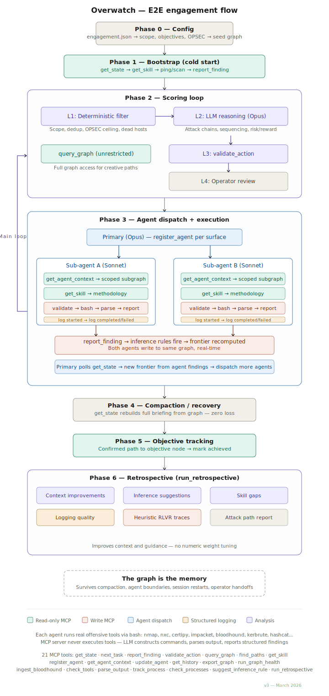

# Overwatch

**An offensive security engagement orchestrator built as an MCP server.**

Overwatch is the persistent state layer and reasoning substrate for LLM-powered penetration testing. It inverts the typical "LLM-as-orchestrator" pattern — instead of stuffing engagement state into a prompt, Overwatch is a **Model Context Protocol server** that the LLM calls into. The graph holds every discovery, relationship, and hypothesis. The LLM proposes actions. The server validates them.

---

## Key Features

- **Graph-based state** — Engagements are directed property graphs (hosts, services, credentials, relationships). Traversable attack paths, not rows in a table.
- **Survives compaction** — The orchestrator lives outside the context window. After compaction, `get_state()` reconstructs a complete briefing. Zero information loss.
- **Hybrid scoring** — Deterministic layer handles hard constraints (scope, dedup, OPSEC vetoes). The LLM handles nuanced reasoning (chain spotting, sequencing, risk).
- **Inference rules** — Findings trigger automatic hypothesis generation (e.g., "SMB signing disabled → relay target"). These become frontier items for the LLM to evaluate.
- **Full graph access** — `query_graph()` gives unrestricted access for creative path discovery beyond scored frontier items.
- **22 MCP tools** — From state management to BloodHound ingestion to structured output parsing.
- **29 offensive skills** — RAG-searchable methodology library covering AD, cloud, web, and infrastructure.
- **Live dashboard** — Real-time WebGL graph visualization with sigma.js.
- **Retrospective analysis** — Post-engagement skill gaps, inference suggestions, and RLVR training traces.

## Quick Start

```bash
git clone https://github.com/keys/overwatch.git
cd overwatch
npm install
npm run build
```

Configure your engagement in `engagement.json`, then add Overwatch to your Claude Code MCP config:

```json
{
  "mcpServers": {
    "overwatch": {
      "command": "node",
      "args": ["<path-to-overwatch>/dist/index.js"],
      "env": {
        "OVERWATCH_CONFIG": "<path-to-engagement.json>",
        "OVERWATCH_SKILLS": "<path-to-overwatch>/skills"
      }
    }
  }
}
```

Then just run `claude` — see the full [Getting Started](getting-started.md) guide.

## Architecture at a Glance



Learn more in [Architecture](architecture.md) or jump to the [Tool Reference](tools/index.md).

