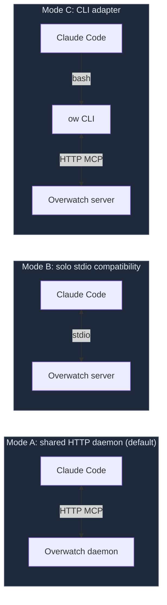

<!-- DOCS_STATUS: archived-unimplemented-design -->

# CLI Adapter (unimplemented design archive)

!!! danger "Not a shipped operator workflow"
    This page preserves an early design proposal. Overwatch does not ship the
    `overwatch-adapter` repository, its `./ow` wrapper, or the commands shown
    below. The page is intentionally absent from active navigation. Use the
    supported [`overwatch` terminal CLI](../cli.md), shared HTTP MCP daemon, or
    explicit solo-stdio compatibility mode instead.

**Goal:** Run Overwatch from a non-MCP environment — when policy blocks MCP, when you're using a non-MCP client, or when you want shell-level auditability.

!!! tip "Most operators don't need this"
    If Claude Code can speak MCP (the default), you're already in the easiest mode. This page is for cases where MCP is unavailable.

## Three transport modes (pick one)



| Mode | When to use | Setup |
|------|-------------|-------|
| **A. shared HTTP daemon** *(default)* | Terminal Claude, dashboard, CLI, and managed agents share one owner | `npm run setup && npm run daemon:start` |
| **B. solo stdio compatibility** | One Claude session; no dashboard/CLI workers | `npm run setup:stdio`, then launch Claude |
| **C. CLI adapter** | MCP blocked by policy / non-MCP client / shell auditability | This page |

The graph, state, and tools are identical across all three. Only the transport differs.

## Do this (CLI adapter setup)

### 1. Start Overwatch in HTTP mode

```bash
cd /path/to/overwatch
npm run setup
npm run daemon:start
```

Binds to `http://127.0.0.1:3000/mcp`.

### 2. Build the CLI adapter

```bash
cd /path/to/overwatch-adapter
npm install && npm run build
```

Note the absolute path — Claude Code will invoke it as `node /absolute/path/to/overwatch-adapter/dist/cli.js <command>`.

### 3. Drop in the AGENTS.md template

Create `AGENTS.md` (or `CLAUDE.md` for Claude Code) in your project root **before launching the AI**. The template tells the AI how to work in CLI mode. Replace `/home/op/overwatch-adapter` and `<OVERWATCH_SERVER>` with your actual values.

??? example "AGENTS.md / CLAUDE.md template (click to expand)"

    ````markdown
    # Overwatch — CLI Adapter Mode

    MCP is not available in this environment. Use the Overwatch CLI adapter instead.
    All Overwatch tools are available as shell commands. Output is JSON by default.

    ## Bootstrap

    Create a wrapper script as your FIRST action. This persists across bash calls:

        cat > ./ow << 'WRAPPER'
        #!/bin/bash
        export OVERWATCH_URL="http://<OVERWATCH_SERVER>:3000"
        exec node /home/op/overwatch-adapter/dist/cli.js "$@"
        WRAPPER
        chmod +x ./ow

    Then use `./ow <command>` for ALL subsequent Overwatch calls.

    ## Execution Model — READ THIS CAREFULLY

    There are TWO execution contexts. Confusing them is the #1 failure mode.

    `./ow` commands run locally and talk to the Overwatch server via HTTP.
    Use `./ow` for ALL Overwatch API calls.

    Offensive tools (nmap, nxc, ldapsearch, smbclient, etc.) must run on the
    target VM, not on your local machine. Either SSH:

        ssh op@<VM_IP> "nmap -Pn -sT -oX - 10.0.0.1"

    or use Overwatch sessions:

        ./ow open-session --kind ssh --target <VM_IP> --title "recon-shell"
        ./ow send-to-session --id SID --command "nmap -Pn -sT -oX - 10.0.0.1" --wait-ms 60000

    `check-tools` reports what is installed on the Overwatch server, not the SSH target.

    ## Session Start

    At the start of every session (including after compaction):

        ./ow get-system-prompt --role primary
        ./ow get-state

    ## Critical Field Names

    - edges use `source`/`target`, NOT `from`/`to`
    - parse-output uses `tool_name` (or `tool`), NOT `parser`
    - update-scope REQUIRES `reason`
    - thread `frontier_item_id` from `next-task` through every call
    - nmap MUST use `-oX -` for parseable XML

    ## Output Convention

    All output is JSON. Parse it directly. Do not add `--human` flag.
    ````

### 4. Launch

```bash
claude
```

The AI reads the template, creates the wrapper script, calls `./ow get-system-prompt --role primary` for the live instructions, and starts driving.

## What's manual vs. automatic

The human does setup once; everything after `claude` launches is autonomous.

| Step | Who | When |
|------|-----|------|
| Write `engagement.json` | Human | Once |
| Start Overwatch HTTP server | Human | Once |
| Build CLI adapter | Human | Once |
| Place `AGENTS.md` / `CLAUDE.md` | Human | Once |
| Start Claude Code | Human | Once |
| **Everything below** | **AI** | **Autonomous** |

---

## Reference

### Common mistakes

| Wrong | Right |
|-------|-------|
| `from`/`to` on edges | `source`/`target` |
| `parser` in parse-output | `tool_name` (or `tool`) |
| Running nmap/nxc locally | Run on VM via SSH or `open-session` |
| Omitting `frontier_item_id` | Thread from `next-task` through every call |
| `nmap -sT 10.0.0.1` (text output) | `nmap -oX - 10.0.0.1` (XML for parser) |
| `update-scope` without `reason` | Always include `reason` |
| Free-text observations for structured data | Use `nodes`/`edges` arrays |

### Key commands

```
./ow get-state                  # full engagement briefing
./ow next-task                  # frontier candidates (returns frontier_item_id)
./ow validate-action --stdin    # validate before executing
./ow log-action                 # log lifecycle (--action-id ID --type action_started)
./ow parse-output --stdin       # parse tool output (use tool_name)
./ow report-finding --stdin     # structured findings (source/target on edges)
./ow query-graph --stdin        # query nodes/edges
./ow check-tools                # tools installed on the SERVER
./ow open-session               # shell (--kind ssh for remote, local_pty for server)
./ow send-to-session            # run command in session
./ow read-session               # read session output
./ow health                     # verify connectivity
./ow reset-session              # clear local cache (no network)
./ow close                      # terminate session + clear cache
./ow tools                      # list all available tools
./ow call <tool_name> --stdin   # escape hatch for any tool
```

### JSON cheat sheet

??? example "validate-action"
    ```bash
    cat << 'EOF' | ./ow validate-action --stdin
    {
      "description": "Enumerate SMB shares on DC",
      "target_ip": "10.0.0.1",
      "technique": "smb_enum",
      "frontier_item_id": "frontier-abc123"
    }
    EOF
    ```

??? example "report-finding (edges use source/target, NOT from/to)"
    ```bash
    cat << 'EOF' | ./ow report-finding --stdin
    {
      "action_id": "ACTION_ID",
      "frontier_item_id": "frontier-abc123",
      "nodes": [
        {"id": "host-10-0-0-1", "type": "host", "label": "10.0.0.1",
         "properties": {"ip": "10.0.0.1"}},
        {"id": "svc-10-0-0-1-445", "type": "service", "label": "SMB:445",
         "properties": {"port": 445, "protocol": "tcp", "service_name": "smb"}}
      ],
      "edges": [
        {"source": "host-10-0-0-1", "target": "svc-10-0-0-1-445", "type": "RUNS"}
      ]
    }
    EOF
    ```

??? example "parse-output (field is tool_name, NOT parser)"
    ```bash
    cat << 'EOF' | ./ow parse-output --stdin
    {
      "tool_name": "nmap",
      "output": "<xml nmap output here>",
      "action_id": "ACTION_ID",
      "frontier_item_id": "frontier-abc123"
    }
    EOF
    ```

??? example "update-scope (reason is required)"
    ```bash
    cat << 'EOF' | ./ow update-scope --stdin
    {
      "add_cidrs": ["10.0.0.0/24"],
      "reason": "Discovered subnet via DNS enumeration",
      "confirm": false
    }
    EOF
    ```
    Set `confirm: false` first to preview, then `confirm: true` to apply.

??? example "log-action (flags only)"
    ```bash
    ./ow log-action --action-id ACTION_ID --type action_started --frontier-item-id FRONTIER_ID
    ./ow log-action --action-id ACTION_ID --type action_completed
    ./ow log-action --action-id ACTION_ID --type action_failed --description "Connection refused"
    ```

### Parser tips

- **nmap**: output MUST be XML — use `-oX -` to write XML to stdout, then pipe into `parse-output`.
- **nxc / netexec**: raw terminal output works directly.
- **ldapsearch**: aliases `ldapsearch`, `ldapdomaindump`, `ldap`. Parses LDIF and ldapdomaindump JSON.
- **certipy, secretsdump, kerbrute, hashcat, responder, enum4linux, rubeus**: all supported, use the tool name.
- **linpeas / linenum**: ANSI text output. Pass `source_host` in `context`.
- **nuclei, nikto, testssl/sslscan, pacu, prowler**: all supported.
- Run `./ow tools` for the full list.

### Walkthrough

For a step-by-step example (network engagement against a Dante-style ProLab via the CLI adapter), see the [End-to-End Walkthrough](walkthrough.md). The patterns are identical to MCP mode — only the transport changes.

## See also

- [Getting Started](../getting-started.md) — the easier MCP-native path
- [Session Instructions](session-instructions.md) — what the AI is being told to do (same in either mode)
- [Operator Playbook](index.md) — pick the right workflow for your engagement
