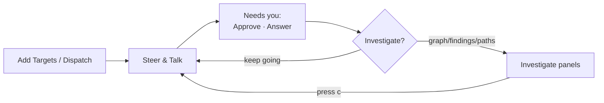

# Cockpit Walkthrough

A narrated tour of the **Operator Console** — the day-to-day loop of dispatching, steering, talking to, approving, and feeding agents without leaving the page. It complements the [Operator Cockpit](../operator-cockpit.md) reference (the runtime + endpoints) and the [Dashboard](../dashboard.md) panel guide; this page is the *workflow*.

!!! note "Console-first"
    The dashboard opens on the **Console**. Nav is grouped **Console** (Console · Frontier · Approvals · Campaigns) · **Investigate** (Graph · Findings · Attack Paths · Evidence · Identity · Credentials · Activity · Overview) · **Manage** (Sessions · Engagements · Settings · Smoke). You work in the Console and step out only to *investigate* — one click out, press `c` to come back.

## The loop

## 1. Add targets

New IPs/CIDRs/domains arrive mid-engagement. Click **Add Targets** in the Console header (beside *Dispatch Subagent*):

1. Paste them — whitespace or comma separated. Parsing matches the `scan` command exactly: a bare IP becomes `/32`, domains are lowercased, IPv6 and junk are flagged and ignored.
2. **Preview impact** — a read-only dry-run shows how many known nodes enter/leave scope and which pending scope suggestions resolve.
3. **Confirm** — applied through the canonical scope path (validation, cold→hot promotion, inference re-run, `scope_updated` audit). New ranges surface `network_discovery` items on the **Frontier**, lazily (no host seeding) — the modal links you straight there to enumerate.

The MCP-tool equivalent is [`update_scope`](../tools/update-scope.md); the command-bar equivalent is `scan 10.30.0.0/24`.

## 2. Dispatch

- **Dispatch Subagent** — target node ids + an optional skill/campaign.
- **Bulk from Frontier** — pick top frontier items and fan out parallel agents (e.g. `network_discovery` over the ranges you just added).

Dispatched agents appear in the **Fleet** roster on the left.

## 3. Steer & talk

Select an agent in the Fleet roster — the main column **focuses** it: its detail, its scoped nodes, its own activity stream, and steering controls.

- **Pause / Resume / Stop** — one-click directives, delivered on the agent's next heartbeat.
- **Tell …** — free-text instruction (e.g. *"focus on SMB"*), delivered the same way.
- **Fleet** controls in the header steer every running agent at once (Pause/Resume/Stop all).

Or just type in the **command bar**: `pause the apache agent`, `tell recon-1 to slow down`, `stop all`. See the [grammar reference](../operator-cockpit.md#grammar).

## 4. Needs you — approve & answer

The **"Needs you"** strip sits at the top of the Console and only appears when something is waiting:

- **Approvals** — pending actions, risk-sorted. **Approve**, or **Deny** with a reason, inline. Resolved rows clear themselves off the live push. High-risk or soon-to-expire items are flagged. *Triage all →* opens the deep **Approvals** view (same controls, more context).
- **Agent questions** — an agent that hit a fork (`ask_operator`) waits for you. **Answer** inline; the reply reaches it on its next heartbeat.

!!! info "One approval surface, one audit trail"
    Approving in the Console, in the Approvals view, or from the terminal all route through the same `resolveApprovalRequest` — OPSEC accounting and the durable approval record stay consistent. A denial always records its reason.

## 5. Investigate, then come back

When you need the picture — *why* an edge exists, the path to an objective, the evidence behind a finding — leave the Console for **Graph**, **Attack Paths**, **Findings**, or **Evidence**. Every console row links to the relevant panel; deep-links carry the node/item. Press **`c`** (or *Back to Console*) to return to where you were.

## See also

- [Operator Cockpit](../operator-cockpit.md) — the runtime, roles, NL two-phase command flow, directive substrate, escalation, and endpoints.
- [Dashboard](../dashboard.md#operator-console-cockpit) — Console layout, Add Targets, and the full endpoint reference.
- [End-to-End Walkthrough](walkthrough.md) — a full engagement arc from empty graph to Domain Admin.
