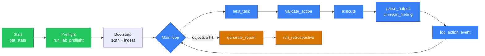

# Operator Playbook

What to do once Overwatch is running. Pick the page that matches your situation:

!!! tip "Haven't installed yet?"
    Stop here and do the [5-minute Quick Start](../getting-started.md#quick-start-5-minutes) first.

## Pick your situation

| You have... | Go to |
|-------------|-------|
| **One target VM** (HTB box, single host) | [HTB / Single Host](htb-single.md) |
| **A network range** to sweep (HTB ProLab, internal scope) | [HTB / Network](htb-network.md) |
| **An Active Directory lab** (GOAD, Proxmox AD) | [GOAD AD Lab](goad-lab.md) |
| **A foothold and want to capture creds** (Responder, ntlmrelayx, fake LDAP) | [Operator Infrastructure](operator-infra.md) |
| **An engagement that just wrapped** | [Retrospectives](retrospective.md) |

## Want to see the full arc?

Read the [End-to-End Walkthrough](walkthrough.md) — a narrated example taking an engagement from empty graph to Domain Admin on a GOAD-like lab. It's the best way to understand what "good" looks like.

## Reference

These pages aren't tutorials — they're answers to specific questions:

- **[parse_output vs report_finding](parse-vs-report.md)** — which tool to use to get data into the graph
- **[Session Instructions](session-instructions.md)** — the core loop (`AGENTS.md` content) for the AI to follow
- **[CLI Adapter](cli-adapter.md)** — operate Overwatch via shell when MCP is unavailable

---

## How an Engagement Actually Flows

The same pattern applies regardless of target type:

You give direction; the AI does the bookkeeping. See [Session Instructions](session-instructions.md) for the exact tool sequence the AI follows.
