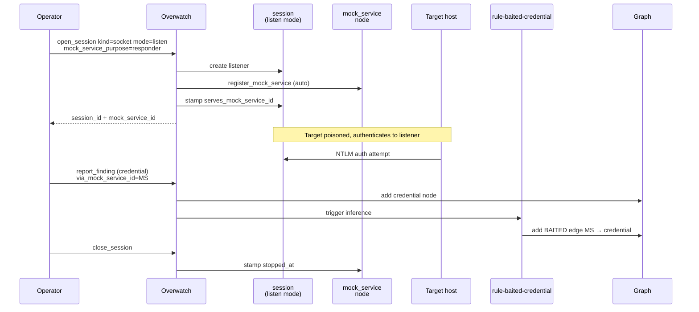

# Operator Infrastructure

Anything you stand up to **receive** incoming connections from the target — Responder, ntlmrelayx, fake LDAP, socat redirector, reverse-shell catcher, capture endpoint — should be a first-class graph object. This page shows how to do that and why it matters.

## Why it matters

Without operator infrastructure in the graph:

- Captured credentials float free of the listener that caught them.
- "We have 3 hashes" is indistinguishable from "our Responder caught 3 hashes."
- Retrospectives can't prove which infrastructure participated in which attack chain.
- The dashboard shows targets but is blind to your own gear.

With it:

- Every captured credential carries a structural `BAITED` edge back to the listener.
- `find_paths` can include operator infrastructure as part of an attack chain.
- The OPSEC scorer reads `opsec_loud` directly off the `mock_service` node instead of guessing from tool names.
- Closing the listener stamps `stopped_at`, so the dashboard renders inactive listeners faded and audit logs know the active window.

## The capture chain



## Workflow A: listen-mode session (recommended)

This is the easy path. One tool call gives you the listener **and** the graph node atomically.

```jsonc
// Step 1. Open a listening session for Responder.
// open_session auto-registers the mock_service and binds it to the session.
{
  "tool": "open_session",
  "args": {
    "kind": "socket",
    "mode": "listen",
    "host": "0.0.0.0",
    "port": 445,
    "mock_service_purpose": "responder",
    "protocol": "smb",
    "notes": "LLMNR/NBT-NS poisoning during lunch window"
  }
}
// → returns { session_id, mock_service_id, ... }

// Step 2. Run Responder under your normal lifecycle (validate → log_action_event
// → run_bash) so the binary's evidence stream lives alongside the listener node.

// Step 3. When Responder catches a hash, report it with via_mock_service_id set.
{
  "tool": "report_finding",
  "args": {
    "nodes": [{
      "type": "credential",
      "id": "cred-corp-victim-ntlmv2",
      "properties": {
        "cred_type": "ntlmv2",
        "cred_value": "<hash>",
        "cred_user": "victim",
        "cred_domain": "CORP"
      }
    }],
    "via_mock_service_id": "<mock_service_id from step 1>",
    "action_id": "...",
    "frontier_item_id": "..."
  }
}
// rule-baited-credential fires → BAITED edge added automatically.

// Step 4. Close the listener.
{ "tool": "close_session", "args": { "session_id": "..." } }
// stopped_at is stamped on the mock_service node.
```

## Workflow B: explicit registration

Use this when the listener is not driven by an Overwatch session — for example, a long-running `ntlmrelayx` started under tmux outside the AI's control.

```jsonc
{
  "tool": "register_mock_service",
  "args": {
    "purpose": "ntlmrelayx",
    "protocol": "smb",
    "bind_host": "10.10.14.5",
    "bind_port": 445,
    "bound_process_id": 31337,
    "target_node": "host-attacker-10.10.14.5",
    "notes": "Relaying SMB → LDAPS on dc01"
  }
}
```

The call is idempotent on `(purpose, bind_host, bind_port, agent_id)` — re-registering refreshes `last_seen_at` without creating duplicates and emits a `mock_service_refreshed` activity event.

## Querying for operator infrastructure

```jsonc
// What listeners are currently active?
{
  "tool": "query_graph",
  "args": {
    "filter": {
      "node_type": "mock_service",
      "properties": { "stopped_at": null }
    }
  }
}

// What did each listener catch?
{
  "tool": "query_graph",
  "args": {
    "edge_type": "BAITED"
  }
}

// What attack paths run through our listeners?
{
  "tool": "find_paths",
  "args": {
    "from_type": "mock_service",
    "to_type": "objective"
  }
}
```

## OPSEC defaults

`register_mock_service` defaults `opsec_loud=true` for these purposes:

- `responder`
- `ntlmrelayx`
- `fake_ldap`
- `smb_capture`

Override per-call with `opsec_loud=false` if the engagement profile says you've already burned that listener anyway, or wrap a quiet listener (e.g. `redirector`, `http_capture`) with `opsec_loud=true` if it's deployed in a way that defenders will notice.

## Related

- [`register_mock_service`](../tools/register-mock-service.md) — full tool reference.
- [Sessions](../tools/sessions.md) — `open_session` listen mode and `mock_service_purpose`.
- [Concepts — Operator Infrastructure](../concepts.md#operator-infrastructure).
- [Graph Model — Operator Infrastructure edges](../graph-model.md#operator-infrastructure).
