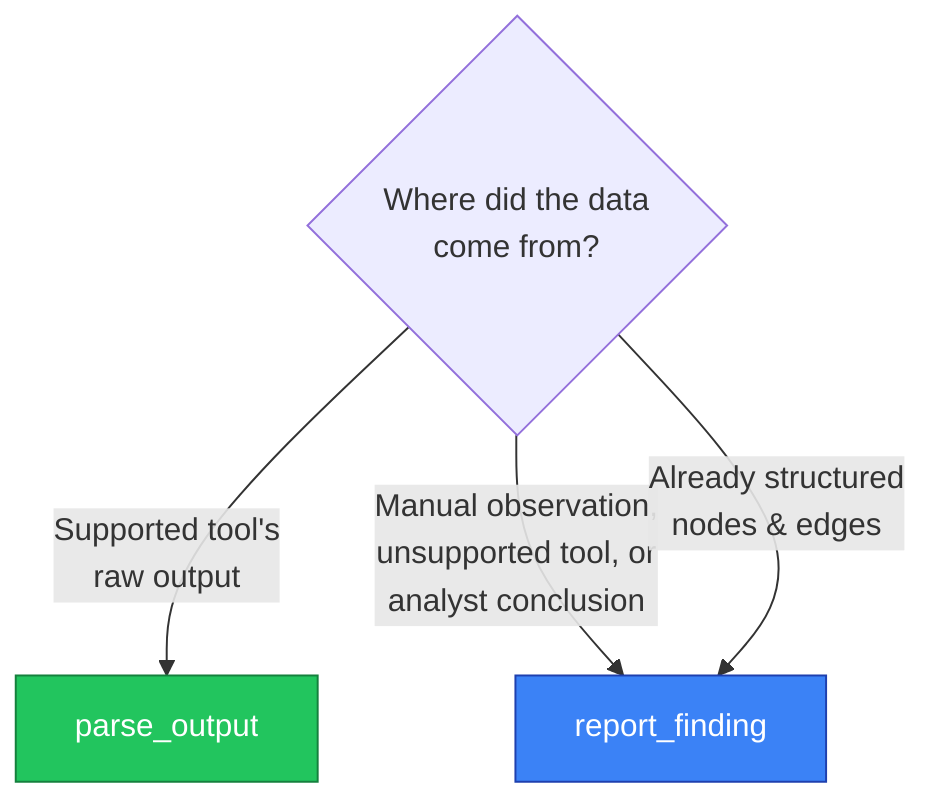

# parse_output vs report_finding

**The one-line answer:** if a parser exists for your tool, use `parse_output`. Otherwise, use `report_finding`.

## Decision tree



## Supported parsers (`parse_output`)

| Category | Parsers |
|----------|---------|
| Network scanning | `nmap`, `nxc` (alias `netexec`) |
| AD enumeration | `ldapsearch` (aliases: `ldapdomaindump`, `ldap`), `enum4linux` (alias `enum4linux-ng`) |
| AD attacks | `kerbrute`, `rubeus`, `certipy`, `getnpusers`, `getuserspns`, `gettgt`, `getst` |
| Credential extraction | `secretsdump` (alias `impacket-secretsdump`), `responder`, `hashcat` |
| SMB/Lateral | `smbclient`, `wmiexec`, `psexec` |
| Web | `gobuster`, `feroxbuster`, `ffuf`, `dirbuster`, `nuclei`, `nikto`, `wpscan`, `sqlmap`, `burp`, `zap` |
| TLS | `testssl`, `sslscan` |
| Linux privesc | `linpeas`, `linenum` |
| Cloud | `pacu`, `prowler` |

Run `parse_output list_parsers=true` to get the live list.

### Why prefer `parse_output`

- **Deterministic** — same input, same nodes/edges, every time.
- **Token-efficient** — the AI doesn't burn context interpreting raw output.
- **Auditable** — original output is stored as evidence, linked to the action.

### Pass `context` when you have it

For parsers that don't always include attribution (secretsdump, hashcat, linpeas):

```jsonc
{
  "tool_name": "secretsdump",
  "output": "Administrator:500:aad3b...",
  "context": {
    "domain": "corp.local",
    "source_host": "10.10.10.5"
  }
}
```

- `domain` — soft hint for `cred_domain` when the output lacks domain prefixes.
- `source_host` — adds `DUMPED_FROM` edges so the credential traces back to where it came from.

## When to use `report_finding`

Anything that isn't a supported parser's output:

- Manual observations ("the login portal at `/admin` accepts `admin:admin`").
- Output from custom scripts or one-off tools.
- Analyst conclusions drawn from multiple data points.
- Already-structured nodes/edges you want to add directly.

```jsonc
{
  "nodes": [
    { "id": "host-10-10-10-5", "type": "host",
      "properties": { "ip": "10.10.10.5", "os": "Windows Server 2019", "alive": true } }
  ],
  "edges": [
    { "source": "host-10-10-10-5", "target": "domain-target-local",
      "type": "MEMBER_OF_DOMAIN", "confidence": 1.0 }
  ]
}
```

## Quick pattern lookup

| Scenario | Use |
|----------|-----|
| Nmap XML output | `parse_output tool_name=nmap` |
| nxc/netexec SMB enum | `parse_output tool_name=nxc` |
| Manual web app discovery | `report_finding` with host + service nodes |
| Certipy `find` results | `parse_output tool_name=certipy` |
| Spotted a login prompt during recon | `report_finding` with service node |
| Secretsdump hashes | `parse_output tool_name=secretsdump` + `context.source_host` |
| Custom shell-script output | `report_finding` with structured nodes/edges |
| Hashcat cracked hashes | `parse_output tool_name=hashcat` |
| Responder log | `parse_output tool_name=responder` (+ `via_mock_service_id` for BAITED edge) |
| Linpeas | `parse_output tool_name=linpeas` + `context.source_host` |

## Tips

- **`ingest: false`** — preview what would be parsed without modifying the graph. Useful when you're unsure.
- **Always pass `action_id`** if you have one (from `validate_action`) — it links the finding to the action that produced it.
- **Always pass `frontier_item_id`** if the action came from a frontier candidate — required for retrospective attribution.
- **Node IDs follow conventions** — `host-<ip>`, `svc-<ip>-<port>`, `user-<domain>-<name>`. The parsers do this automatically; for `report_finding` you should match the pattern.
