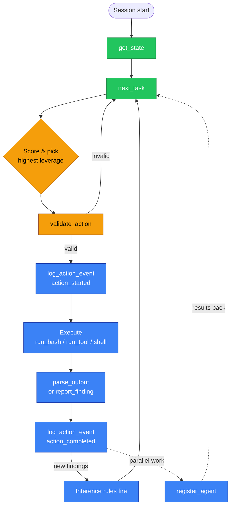

# Session Instructions

**Goal:** Tell the AI how to drive Overwatch correctly. This is the content that lives in `AGENTS.md` (or `CLAUDE.md` for Claude Code) at the project root.

!!! tip "You probably don't need to read this"
    The repo already ships an [`AGENTS.md`](https://github.com/professor-moody/overwatch/blob/main/AGENTS.md) at the root. Claude Code reads it automatically. This page exists so you understand what the AI is being told to do, and so you can customize it if you need to.

## What the AI does (the core loop)

In plain words:

1. **Start by reading state.** `get_state()` gives the full briefing — scope, discoveries, access, objectives, frontier. Every session starts here, including after compaction.
2. **Look at the frontier.** `next_task()` returns candidates already filtered by the deterministic layer (out-of-scope / duplicate / OPSEC-vetoed items are gone).
3. **Pick the best one.** This is where the AI does real work — score by chain potential, sequencing, risk, distance to objective.
4. **Validate.** `validate_action()` returns an `action_id` and a verdict.
5. **Log start, execute, parse/report, log finish.** Always carry `action_id` and `frontier_item_id` through.
6. **Repeat.** New findings fire inference rules, which create new frontier items.
7. **Parallelize.** Independent tasks → `register_agent()` for sub-agents.

## Key principles

- **The graph is memory.** After compaction, `get_state()` rebuilds everything. Don't try to hold engagement state in context.
- **Report early, report often.** Every `report_finding` triggers inference rules that may surface new attack paths.
- **Always thread `frontier_item_id`.** From `next_task` → `validate_action` → `log_action_event` → `parse_output` / `report_finding`. Without it, retrospectives lose causal attribution.
- **Validate before executing.** Catches scope, OPSEC, and impossible-target issues before you waste an action.
- **Use `query_graph` liberally.** If the frontier doesn't surface a pattern you're seeing, query for it directly.
- **Respect OPSEC.** Read the engagement's OPSEC profile and weight noise into your decisions.

## Sub-agent instructions

When dispatching agents with `register_agent`, give them this charter:

> You are an Overwatch sub-agent working a specific task. Your tools:
>
> - `get_agent_context` — scoped subgraph view
> - `validate_action` — check before executing
> - `log_action_event` — record action start/completion/failure
> - `log_thought` — record reasoning, decisions, alternatives
> - `run_bash`, `run_tool` — auto-instrumented one-shot execution
> - `parse_output`, `report_finding` — get findings into the graph
> - `query_graph`, `get_skill` — context lookup
> - `open_session` / `write_session` / `read_session` / `send_to_session` / `list_sessions` / `resume_session` / `close_session` — sessions
> - `submit_agent_transcript` — wrap-up handoff before you're closed out
>
> Validate first, log start, execute, parse/report, log completion. The primary will mark you done.

The full charter (with all 49 sub-agent tools and per-tool guidance) is in [`AGENTS.md`](https://github.com/professor-moody/overwatch/blob/main/AGENTS.md).

## Customizing the prompt

The AI bootstraps from one of these sources, in order of preference:

1. **`get_system_prompt(role="primary")`** — generated dynamically from current state (preferred). Includes live tool table, briefing, OPSEC constraints.
2. **`AGENTS.md`** at the project root — static fallback when MCP isn't available.
3. **`CLAUDE.md`** — Claude Code reads this first if present; in our repo it just points at `AGENTS.md`.

If you want to change how the AI behaves (different scoring weights, additional principles, custom workflows), edit `AGENTS.md` and the AI will pick it up on next session start. Don't edit it during an active session — Claude Code only reads it at startup.

## See also

- [Operator Playbook](index.md) — what to actually do once the AI is running
- [parse_output vs report_finding](parse-vs-report.md) — which to use for what
- [Concepts — Action Lifecycle](../concepts.md#action-lifecycle) — the deeper "why" behind the loop
