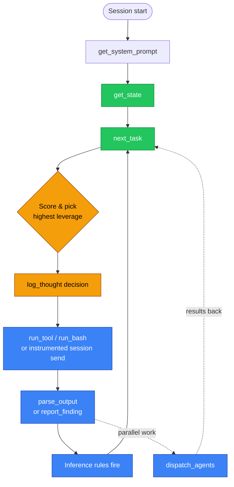

# Session Instructions

**Goal:** Explain where the live operator prompt comes from and summarize the
workflow it teaches.

!!! info "Runtime authority"
    `get_system_prompt(role="primary")` is authoritative. It is generated from
    the current engagement, runtime tool registry, OPSEC state, and prompt
    generator each time it is requested. The repository's
    [`AGENTS.md`](https://github.com/professor-moody/overwatch/blob/main/AGENTS.md)
    is a contributor-visible mirror and offline fallback. Editing that file
    alone does not change the generated runtime prompt.

## What the AI does (the core loop)

In plain words:

1. **Load the live charter, then state.** `get_system_prompt(role="primary")`
   supplies current instructions and tools. `get_state()` supplies the
   operational briefing—scope, discoveries, access, objectives, frontier, and
   coordination state. Repeat both after compaction.
2. **Look at the frontier.** `next_task()` returns candidates already filtered by the deterministic layer (out-of-scope / duplicate / OPSEC-vetoed items are gone).
3. **Pick and record the decision.** Score by chain potential, sequencing,
   risk, and distance to the objective, then use `log_thought` with the selected
   `frontier_item_id`.
4. **Execute through an instrumented path.** Prefer `run_tool` for binary/argv
   execution and `run_bash` only for real shell syntax. They perform validation,
   approval, action lifecycle logging, evidence capture, and optional parsing.
   Use explicit `validate_action` / `log_action_event` only when recording work
   Overwatch cannot observe directly.
5. **Land results immediately.** Use `parse_output` for supported tool output or
   `report_finding` for judgment and structured discoveries. Preserve the
   returned `action_id` and selected `frontier_item_id`.
6. **Repeat or dispatch.** New findings fire inference rules. Send independent
   frontier work through `dispatch_agents`; do not use an untracked host-runtime
   task mechanism.

## Key principles

- **Durable state is outside model context.** After compaction, use `get_state()` to rebuild the working briefing instead of relying on conversational memory. Use `get_history`, `get_evidence`, or `bundle_engagement` for records and artifacts omitted from the briefing. Live PTYs, sockets, process objects, and buffers are ephemeral even when their descriptors or resume intent persist.
- **Report early, report often.** Every `report_finding` triggers inference rules that may surface new attack paths.
- **Always thread `frontier_item_id`.** Carry it from `next_task` through the
  instrumented runner and `parse_output` / `report_finding`. Without it,
  retrospectives lose causal attribution.
- **Use the instrumented runners.** They validate scope/OPSEC, obtain approval
  when policy requires it, capture evidence, and close the action lifecycle.
- **Use `query_graph` liberally.** If the frontier doesn't surface a pattern you're seeing, query for it directly.
- **Respect OPSEC.** Read the engagement's OPSEC profile and weight noise into your decisions.

## Sub-agent instructions

`dispatch_agents` registers each task with a frontier lease and supplies the
generated sub-agent prompt automatically. That prompt restricts the worker to
its task/archetype and teaches the same orient → validate → execute → land →
wrap loop. The generated prompt and archetype registry are authoritative for
the exact allowlist; this page does not duplicate that changing list.

Every normal sub-agent starts with `get_agent_context`, uses instrumented
execution/session tools, lands useful results with `parse_output` or
`report_finding`, heartbeats during long work, honors/acknowledges operator
directives and answers, and finishes with `submit_agent_transcript`.

Specialized planner and research workers are deliberately narrower. Planners
may inspect state and propose a confirmable plan but cannot execute against
targets. Research workers may perform public research and record candidates but
cannot run target actions. Archetype allowlists further constrain normal
sub-agents.

In the recommended daemon mode, terminal Claude and dashboard-managed workers
are separate Claude processes attached to the same Overwatch engine. Managed
workers use task-specific strict MCP configuration, user-only Claude settings,
and no Claude session persistence, so the terminal's project settings/hooks and
resume history do not override a scoped agent or planner prompt. Overwatch task
leases and durable playbook ownership coordinate the shared work.

## Customizing the prompt

The AI receives guidance from these sources:

1. **`get_system_prompt(role="primary")`** — generated dynamically from current state (preferred). Includes live tool table, briefing, OPSEC constraints.
2. **`AGENTS.md`** at the project root — checked-in offline fallback and
   contributor-visible mirror.
3. **`CLAUDE.md`** — Claude Code bootstrap that points at the fallback.

Changing `AGENTS.md` changes only fallback behavior. Runtime behavior belongs in
the prompt generator, tool/archetype registries, and skill files, with their
generated inventories and tests updated together. Restart the relevant model
session after changing bootstrap files; call `get_system_prompt` again after a
runtime prompt or engagement-state change.

## See also

- [Operator Playbook](index.md) — what to actually do once the AI is running
- [parse_output vs report_finding](parse-vs-report.md) — which to use for what
- [Concepts — Action Lifecycle](../concepts.md#action-lifecycle) — the deeper "why" behind the loop
